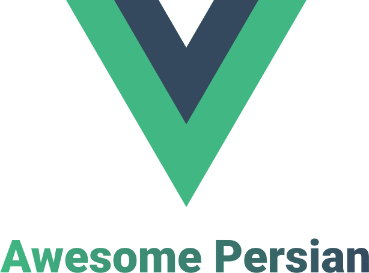

   
  
   
   

# awesome-vue-persian
A curated list of awesome Vuejs And Nuxtjs persian plugins, components and filters.

 - [JavaScript](#javascript)
 - [Vuejs](#vuejs)
 - [Nuxtjs](#Nuxtjs)
 - [vuepress](#vuepress)
 - [PersianNuxtjs](#persianNuxtjs)
 - [PersianVuejs](#persianvuejs)
 - [PersianVuepress](#vuepress)
 
 
Type

Name | Description

:star: Plugins

[@vue-persian-datetime-picker](https://github.com/talkhabi/vue-persian-datetime-picker) | A vue plugin to select jalali date and time

[@fullcalendar-Jalaali](https://github.com/Natico/fullcalendar-Jalaali) | Display a full-size drag-n-drop event calendar, leveraging jQuery . http://fullcalendar.io A JavaScript event calendar. Customizable and open 
source.

[modaltor-vue-js](https://github.com/davodaslanifakor/modaltor) | vue modal component for vuejs and i hope it be useful for everyone ...

:star: Filters

Filter | [@vue-persian-filters](https://github.com/aliyr/vue-persian-filters) | a vue plugin for filtering strings and arrays

:star: Apps/Websites

 - [alibaba.ir](https://www.alibaba.ir)
 - [anten.ir](https://www.anten.ir)
 - [Lenz.ir](http://lenz.ir)
 - [90tv.ir](https://90tv.ir)
 - [yasha.io](https://yasha.io)
 - [corporate.snapp.taxi](https://corporate.snapp.taxi)
 - [phonepay.ir](https://www.phonepay.ir)
 - [jobinja.ir](https://jobinja.ir)
 - [roozame.com](http://www.roozame.com)
 - [naaab.ir](http://www.naaab.ir)
 - [fandogh.cloud](https://fandogh.cloud)
 - [blog.fandogh.cloud](https://blog.fandogh.cloud)
 - [tebinja.com](http://tebinja.com)
 - [blog.tebinja.com](https://blog.tebinja.com)
 - [madya.ir](http://www.madya.ir)
 - [RJDownloader](https://narsiiis.github.io/rjdownloader/)
 - [ostadbank](https://www.ostadbank.com)
 - [botick.com](https://botick.com/)
 - [basalam.com](https://basalam.com/)

